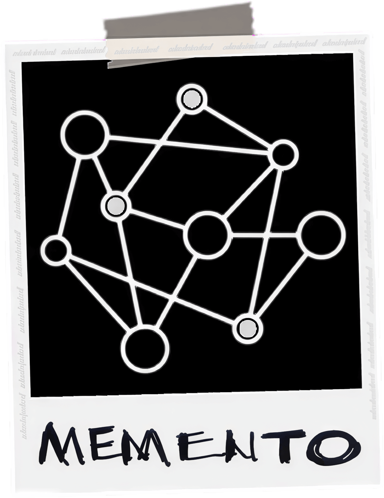
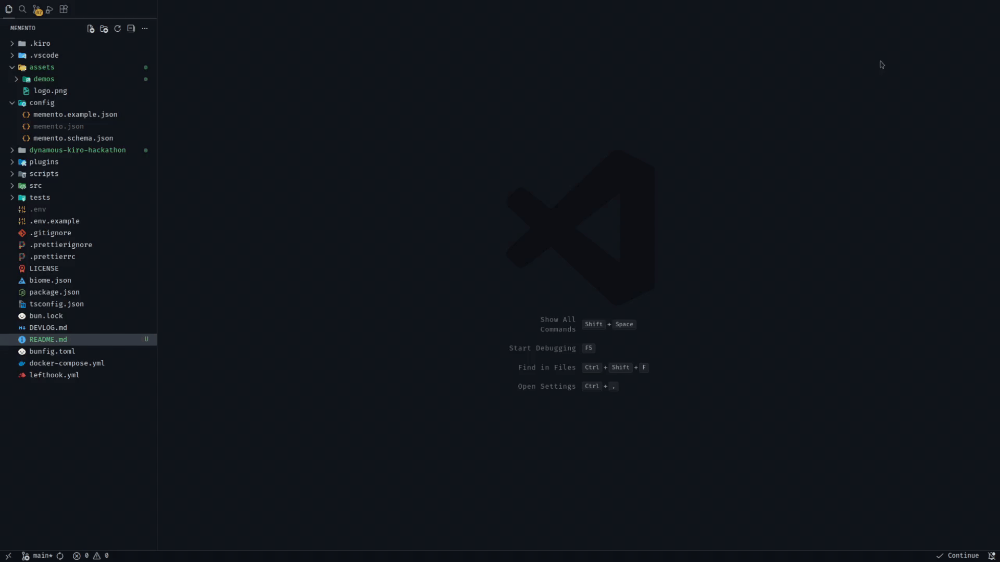
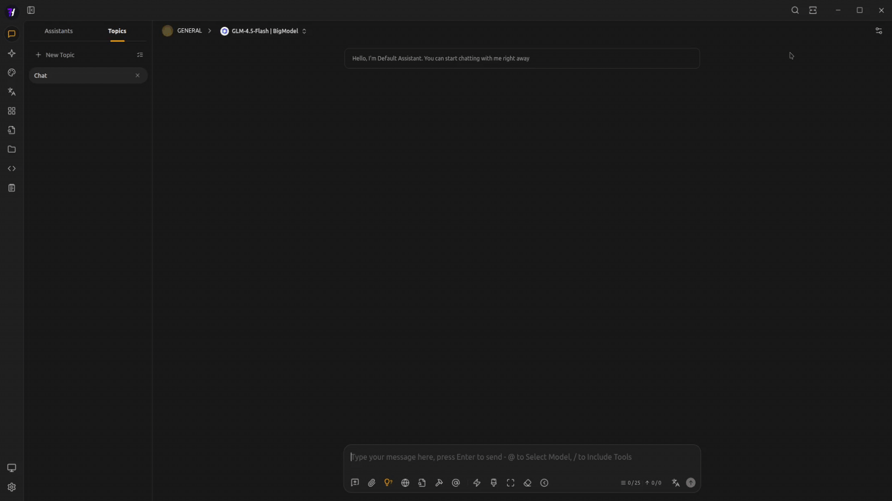

<p align="center">
  
</p>

<h1 align="center">Memento</h1>

<h2 align="center">Memory that thinks, not just remembers!</h2>

<p align="center">
  <a href="https://github.com/aziham/memento/stargazers">
    
  </a>
  <a href="https://github.com/aziham/memento/blob/main/LICENSE">
    
  </a>
  <a href="https://github.com/aziham/memento/issues">
    
  </a>
</p>

---

## Table of Contents

- [The Condition](#the-condition)
- [The Cure](#the-cure)
- [Quick Start](#quick-start)
  - [Prerequisites](#prerequisites)
  - [Installation](#installation)
  - [Verify It's Working](#verify-its-working)
- [Integration Guide](#integration-guide)
  - [Compatibility](#compatibility)
  - [Continue.dev](#continuedev)
  - [Cherry Studio](#cherry-studio)
  - [Other Clients](#other-clients)
- [Key Features](#key-features)
  - [Transparent Proxy](#transparent-proxy)
  - [The `.note()` MCP Tool](#the-note-mcp-tool)
  - [Knowledge Graph Storage](#knowledge-graph-storage)
  - [The Retrieval Engine](#the-retrieval-engine)
  - [The Consolidation Engine](#the-consolidation-engine)
- [Architecture](#architecture)
  - [System Overview](#system-overview)
  - [Technology Stack](#technology-stack)
- [Built with Kiro CLI](#built-with-kiro-cli)
- [Why Memento?](#why-memento)
- [License](#license)
- [Credits](#credits)

---

## The Condition

**Your AI has anterograde amnesia.**

In neurology, anterograde amnesia is the inability to create new memories after an event that caused amnesia, leading to a partial or complete inability to recall the recent past, while long-term memories from before the event remain intact. For LLMs, that event is the end of their training. Everything after that? Gone the moment the conversation ends.

You tell your AI:

- "I prefer TypeScript over JavaScript"
- "We use Tailwind for styling"
- "Never commit directly to main"
- "The API key is in the .env file"

Next session? **Blank slate.** You're explaining it all over again. And again. And again.

### But It Gets Worse: The Attention Decay Problem

Even within a single conversation, your AI is forgetting.

**The "Lost in the Middle" phenomenon:**

```
┌───────────────────────────────────────────────────────────────┐
│  ATTENTION STRENGTH ACROSS CONTEXT WINDOW                     │
├───────────────────────────────────────────────────────────────┤
│                                                               │
│  Strong  ██████                              ████████         │
│          ██████                              ████████         │
│  Medium  ██████             ████             ████████         │
│          ██████           ████████           ████████         │
│  Weak    ██████         ████████████         ████████         │
│          ████████████████████████████████████████████         │
│          ▲                   ▲                      ▲         │
│          │                   │                      │         │
│       Beginning       Middle = Lost                End        │
│     (Remembered)                            (Remembered Best) │
│                                                               │
│                                                               │
└───────────────────────────────────────────────────────────────┘
```

**What this means in practice:**

```
Turn 1: "Use TypeScript for this project"          [Beginning - OK]
Turn 5: "Make sure to add error handling"          [Middle - LOST]
Turn 10: "And use async/await for API calls"       [End - Remembered]

Result: AI remembers TypeScript and async/await,
        but forgets the error handling requirement.
```

This isn't a bug. It's how transformer attention works. Instructions in the middle of long conversations get **mathematically deprioritized** by the attention mechanism.

**The symptoms:**

- **Repetition fatigue** — "I prefer TypeScript" × 100
- **Context amnesia** — Instructions at the start get "forgotten" as the conversation grows
- **Middle instruction loss** — Critical requirements buried in conversation get ignored
- **Recency bias** — Only the last few messages get full attention
- **No learning** — Can't improve, can't evolve, can't remember what worked
- **Relationship loss** — Every conversation is with a stranger

Traditional solutions (cramming everything into system prompts, explicit RAG queries) make the AI obviously "look things up" rather than "know."

---

## The Cure

**Memento gives your AI the ability to form new memories.**

Human-like memory that surfaces naturally when needed.

### How Human Memory Actually Works

When you see a red door, you don't consciously search your brain for "red door memories." The memory of your childhood home just... surfaces. Automatically. Contextually. Naturally.

**That's because human memory is:**

- **Associative** — Connected by relationships, not keywords
- **Contextual** — Triggered by relevance, not explicit queries
- **Temporal** — Knows what was true when, and what changed
- **Selective** — Remembers what matters, forgets the noise

**Memento replicates this.**

```
┌──────────────┐     ┌─────────────────────┐     ┌─────────────┐
│    Client    │────▶│      MEMENTO        │────▶│  LLM API    │
│  (any app)   │◀────│  (Proxy + Memory)   │◀────│ (any model) │
└──────────────┘     └──────────┬──────────┘     └─────────────┘
                                │
                                ▼
                      ┌─────────────────────┐
                      │   Knowledge Graph   │
                      │   (Neo4j/DozerDB)   │
                      └─────────────────────┘
```

**The process:**

1. **Intercepts** every LLM request (transparent proxy)
2. **Retrieves** relevant memories using memento's retrieval engine
3. **Prepends** memories to your last message (not the system prompt)
4. **Forwards** enriched request to your LLM provider
5. **Stores** new knowledge when you explicitly tell it to (via `.note()` tool)

**Why prepending to the last message solves attention decay:**

Remember that "Lost in the Middle" diagram? Information buried in the middle of long contexts gets mathematically deprioritized by transformer attention mechanisms.

By prepending memories **directly before your current message** (not at the beginning, not in the system prompt), they fall in the **high-attention zone** at the end of the context window. This exploits the transformer's recency bias, so the model naturally gives maximum weight to the most recent tokens.

**Result:** The AI "just knows" your preferences without the middle-context penalty. Memories feel natural, not like database lookups.

**Why `.note()` mcp tool instead of automatic extraction:**

Most RAG systems automatically extract everything from your conversations. Memento doesn't. Here's why explicit beats automatic:

- **Quality over quantity** — Only explicitly important information gets stored, keeping the graph clean and signal rich
- **User control & privacy** — You decide what's memorable, not an algorithm guessing from every sentence
- **Explicit intent > inferred importance** — "Remember this" is a much stronger signal than statistical extraction
- **Cognitive alignment** — Your brain doesn't remember everything either. Selective encoding is how human memory actually works
- **No noise** — Avoids storing conversational filler, tangents, or irrelevant details that pollute retrieval
- **Trust & transparency** — You know exactly what's stored because you triggered it

**The philosophy:** A few high-quality, intentional memories beat thousands of noisy auto-extractions. Human memory is curated, not comprehensive, and that's what makes it work.

**The result:** AI that remembers like a human, not a database.

---

## Quick Start

Get Memento running in under 5 minutes.

### Prerequisites

- **Bun** 1.x ([install](https://bun.sh))
- **Docker** & Docker Compose
- **LLM API key** (OpenAI, Anthropic, Groq, Cerebras, etc.)
- **Embedding API key** (OpenAI, Cloudflare, or same as LLM if supported)

### Installation

```bash
# 1. Clone and install
git clone https://github.com/aziham/memento
cd memento
bun install

# 2. Start the graph database
docker compose up -d

# 3. Configure environment variables
cp .env.example .env
# Edit .env and add your API keys

# 4. Configure Memento
cp config/memento.example.json config/memento.json
# Edit config/memento.json to customize providers and models

# 5. Start Memento
bun run start
```

Memento runs on `http://localhost:6366` by default.

**Configuration Notes:**

- API keys are stored in `.env` (gitignored for security)
- The config file references them using `{env:VARIABLE_NAME}` syntax
- Example: `"apiKey": "{env:OPENAI_API_KEY}"`
- You can customize LLM providers, embedding models, and other settings in `config/memento.json`

**Example configuration (`config/memento.json`):**

```json
{
  "$schema": "./memento.schema.json",

  "server": {
    "port": 6366
  },

  "proxy": {
    "provider": "custom",
    "protocol": "openai",
    "providerName": "Groq",
    "baseUrl": "https://api.groq.com/openai/v1"
  },

  "llm": {
    "provider": "openai-compatible",
    "providerName": "Cerebras",
    "apiKey": "{env:CEREBRAS_API_KEY}",
    "baseUrl": "https://api.cerebras.ai/v1",

    "defaults": {
      "model": "gpt-oss-120b",
      "temperature": 0.5,
      "maxTokens": 15000,
      "maxRetries": 3,
      "options": {
        "reasoning_effort": "high"
      }
    }
  },

  "embedding": {
    "provider": "openai-compatible",
    "providerName": "Cloudflare",
    "model": "@cf/qwen/qwen3-embedding-0.6b",
    "dimensions": 1024,
    "apiKey": "{env:CLOUDFLARE_API_KEY}",
    "baseUrl": "https://api.cloudflare.com/client/v4/accounts/{env:CLOUDFLARE_ACCOUNT_ID}/ai/v1"
  }
}
```

### Verify It's Working

<p align="center">
  
</p>

**Next:** Configure your AI client to use Memento (see Integration Guide below).

---

## Integration Guide

Memento integrates with AI clients through two methods that work together:

| Method                | What it does            | How it works                                       |
| --------------------- | ----------------------- | -------------------------------------------------- |
| **Transparent Proxy** | Automatic memory recall | Route LLM calls through `http://localhost:6366/v1` |
| **MCP Tool**          | Explicit memory storage | Connect to `http://localhost:6366/mcp`             |

**You need both** for the full experience: proxy for recall, MCP for storage.

### Compatibility

Memento works with **any client** that supports:

- **Custom API base URL** (for the proxy)
- **MCP via HTTP Streamable transport** (for the `.note()` tool)

This includes most modern AI coding assistants, chat interfaces, and LLM clients. If your client lets you change the API endpoint and connect to MCP servers, it works with Memento.

The examples below are **open-source clients I've personally tested**. If your client isn't listed, see [Other Clients](#other-clients) for generic setup instructions.

---

### Continue.dev

<p align="center">
  
</p>

Edit `~/.continue/config.yaml`:

```yaml
# 1. Route LLM calls through Memento proxy
models:
  - name: Kimi K2 / Groq
    provider: openai
    model: moonshotai/kimi-k2-instruct-0905
    apiBase: http://localhost:6366/v1
    apiKey: ${{ secrets.GROQ_API_KEY }}
    roles:
      - chat
    capabilities:
      - tool_use

# 2. Add Memento MCP server for .note() tool
mcpServers:
  - name: memento
    type: streamable-http
    url: http://localhost:6366/mcp
```

Reload Continue to apply changes.

---

### Cherry Studio

<p align="center">
  
</p>

**1. Proxy Setup**

1. Open **Settings**
2. Go to **Model Provider**
3. Click **Add Provider**
4. Configure:
   - **API Key**: Your LLM provider's API key
   - **API Host**: `http://localhost:6366/v1`
5. Go to **Models** and select your LLM

**2. MCP Setup**

1. Open **Settings**
2. Go to **MCP Servers**
3. Click **Add MCP**
4. Configure:
   - **Name**: `memento`
   - **Type**: `Streamable HTTP`
   - **URL**: `http://localhost:6366/mcp`
5. Click **Save**

---

### Other Clients

Your client not listed? If it supports custom endpoints and MCP, it works with Memento.

| Setting        | Value                       |
| -------------- | --------------------------- |
| LLM Base URL   | `http://localhost:6366/v1`  |
| MCP Server URL | `http://localhost:6366/mcp` |
| MCP Transport  | HTTP Streamable             |

Check your client's documentation for where to configure these settings.

**Coming in v0.2:** Support for clients that don't expose `baseURL` configuration (like **Kiro**) through their plugin/hook systems. These integrations will intercept prompts and inject memories via client-specific extensions rather than HTTP proxy.

---

### Verify It's Working

**1. Test memory recall (proxy):**

Ask your AI something you've previously noted. It should "just know" without you reminding it.

**2. Test memory storage (MCP):**

Say "Note/Remember that I prefer dark mode" — your AI should use the `memento_note` tool.

**3. Inspect your graph** in Neo4j Browser (`http://localhost:7474`):

<p align="center">
  
</p>

---

## Key Features

### Transparent Proxy

Memento sits between your AI client and your LLM provider. Every request passes through, gets enriched with relevant memories, and continues to the provider. Your client doesn't know. Your provider doesn't know. It just works.

**Supported providers:**

| Provider  | Protocol  | Endpoints                                   |
| --------- | --------- | ------------------------------------------- |
| OpenAI    | OpenAI    | `/v1/chat/completions`                      |
| Anthropic | Anthropic | `/v1/messages`                              |
| Ollama    | OpenAI    | `/v1/chat/completions`, `/api/chat`         |
| Custom    | Either    | Any OpenAI or Anthropic-compatible provider |

**The only requirement:** Your client must support setting a custom `baseURL` or API endpoint.

**Before:**

```
baseURL: 'https://api.openai.com/v1'
```

**After:**

```
baseURL: 'http://localhost:6366/v1'
```

**What happens on every request:**

1. Extract user query and generate embedding
2. Retrieve relevant memories (see [The Retrieval Engine](#the-retrieval-engine))
3. Format as structured XML with entities, provenance, timestamps
4. Prepend to last user message in `<memento>` tags (exploits [recency bias](#the-cure))
5. Forward enriched request to upstream provider
6. Stream response back to client

**The memory format:**

Memories are injected as structured XML for maximum LLM comprehension:

```xml
<memento>
<current-date>2025-06-14</current-date>

<query>What editor do I use?</query>

<entities>
  <entity name="Zed" type="Technology">
    <description>Modern code editor written in Rust</description>
  </entity>
</entities>

<notes>
  <note id="note-01" timestamp="2025-06-01">
    <content>I switched to Zed for editing</content>
  </note>
</notes>

<memories>
  <memory valid_since="2025-06-01">
    <content>USER uses Zed as their primary code editor</content>
    <about>
      <entity>Zed</entity>
      <entity>USER</entity>
    </about>
    <extracted_from note_id="note-01"/>
  </memory>
</memories>
</memento>

What editor do I use?
```

**Key properties:**

- **Graceful degradation** — If retrieval fails, request continues without memories
- **Streaming preserved** — SSE streams pass through unchanged
- **Format agnostic** — Works with string content or content block arrays
- **Header sanitization** — Strips sensitive headers before forwarding

### The `.note()` MCP Tool

**The interface between you and your AI's memory.**

While the proxy handles automatic recall, the `.note()` tool handles explicit storage. It's exposed as an MCP tool (`memento_note`) that your AI calls when you ask it to remember something.

**The workflow:**

```
User: "Remember that I prefer dark mode"
AI: I'll note: "I prefer dark mode for all applications." Save?
User: "yes"
→ memento_note(content="I prefer dark mode for all applications.", confirmed=true)
→ "Noted."
```

**Why confirmation is required:**

Every note requires explicit user confirmation before storage. This isn't just UX — it's a core design principle:

- **No accidental saves** — The AI can't store information without your approval
- **Chance to refine** — You can correct the draft before it's committed
- **Trust through transparency** — You see exactly what's being stored

**Writing style:**

Notes are written in first-person voice (`I`, `my`, `me`) and should be:

- **Concise** — Facts, not prose
- **Self-contained** — Standalone without conversation context
- **Rich in details** — Full names, specifics, not vague references

**What happens behind the scenes:**

When you confirm a note, Memento's consolidation engine:

1. Extracts entities (people, organizations, technologies...)
2. Extracts memories in third-person (`"USER prefers dark mode"`)
3. Checks for contradictions with existing knowledge
4. Invalidates outdated memories with reasons
5. Writes everything to the knowledge graph atomically

See [The Consolidation Engine](#the-consolidation-engine) for the full pipeline.

### Knowledge Graph Storage

**Memento is memory centric, not entity centric.**

Memories aren't stored in a flat database. They're stored in a **graph** mimicking how your brain connects ideas. In Memento, memories are first-class citizens, and relationships emerge through shared context.

**How it works:**

`.note("I prefer TypeScript over JavaScript for type safety")` creates:

**Nodes:**

- Note: "I prefer TypeScript..." (raw input)
- Memory: "USER prefers TypeScript over JavaScript for type safety" (extracted, 3rd person)
- Entity: TypeScript [Technology]
- Entity: JavaScript [Technology]

**Edges:**

- Memory → ABOUT → User
- Memory → ABOUT → TypeScript
- Memory → ABOUT → JavaScript
- Memory → EXTRACTED_FROM → Note
- Note → MENTIONS → TypeScript, JavaScript

**Key:** No direct TypeScript→JavaScript edge. The memory connects them through shared context.

**Node Types:**

- **User** — Singleton (all first-person references)
- **Entity** — 7 types: Person, Organization, Project, Technology, Location, Event, Concept
- **Memory** — Rich facts in natural language
- **Note** — Raw `.note()` input (provenance)

**Edge Types:**

- **ABOUT** — Memory → Entity/User
- **EXTRACTED_FROM** — Memory → Note
- **MENTIONS** — Note → Entity
- **INVALIDATES** — Memory → Memory (with reason)

**Why this matters:**

**Query: "What programming language I use at work?"**

Memento retrieves:

```
1. "USER prefers TypeScript over JavaScript for type safety"
2. "USER works at Acme Corp as a senior engineer"
3. "Acme Corp's main project uses TypeScript"
```

The LLM **reasons** from context:

- Hamza works at Acme Corp
- Acme Corp uses TypeScript
- Hamza prefers TypeScript
- **Inference:** Hamza uses TypeScript at work (with explanation)

Instead of just returning `"TypeScript"`, the LLM understands **why** and can explain.

**The advantages:**

1. **No schema rigidity** — Express any relationship in natural language
2. **Context preservation** — Full sentences, not lossy triples
3. **Temporal evolution** — INVALIDATES tracks **what** changed and **why**
4. **LLM reasoning** — Rich context enables inference, not just retrieval
5. **Memory-centric** — Graph for traversal, natural language for reasoning

**The philosophy:**

Traditional knowledge graphs are entity-centric: entities are nodes, relationships are edges, facts are properties.

**Memento inverts this:** memories are nodes, entities are connection points, relationships emerge from shared context.

**Why this matters:** When you ask "What programming language I use at work?", you're not querying a database schema. You're triggering a memory-cascade: work memories, technology preferences, company context, and the LLM reasons across them.

Your brain works the same way. You don't store `(User)-[WORKS_AT]->(Acme)`. You remember experiences: the first day, the project, the team. The relationship is implicit in the memories.

**That's what Memento replicates.** Graph structure for traversal (spreading activation via EXPAND phase). Natural language for reasoning (LLM interpretation of rich context). Together, they create memory that thinks, not just remembers.

### The Retrieval Engine

**Traditional RAG is Ctrl+F with embeddings.** You search for "rate limits" and get back documents containing those words. But that's not how memory works.

When you think "rate limits," your brain doesn't search for keywords. It triggers a cascade: that time you debugged the 429 errors, the exponential backoff pattern you learned, the production config with 3 retries and 2x backoff, the article about jitter preventing thundering herds.

These memories are connected by **meaning**, not keywords. They surface because they're **relevant**, not because they match a search term.

**Memento replicates this with a 5-phase retrieval pipeline that mimics human memory recall.**

#### The 5-Phase Pipeline

```
Query
  │
  ▼
┌────────────────────────────────────────────────────────────────────────────────┐
│  LAND - Cast wide net with vector + fulltext search                            │
│                                                                                │
│  Query ──► Embed ──┬──► Vector Search (HNSW) ────────────┐                     │
│                    │                                     │                     │
│                    └──► Fulltext Search (BM25) ──────────┤                     │
│                                                          │                     │
│                                                          ▼                     │
│                                            ┌──────────────────────────┐        │
│                                            │  FUSION PIPELINE         │        │
│                                            │                          │        │
│                                            │  1. Distribution Align   │        │
│                                            │     (align μ, σ)         │        │
│                                            │                          │        │
│                                            │  2. Min-Max Normalize    │        │
│                                            │     (scale to 0-1)       │        │
│                                            │                          │        │
│                                            │  3. Coverage Penalty     │        │
│                                            │     (adjust weights)     │        │
│                                            │                          │        │
│                                            │  4. Weighted Average     │        │
│                                            │     (70% vec, 30% txt)   │        │
│                                            └─────────────┬────────────┘        │
│                                                          │                     │
│  Filter: validOnly=true (WHERE invalid_at IS NULL)       │                     │
│  Output: Top 100 seed memories                           │                     │
└──────────────────────────────────────────────────────────┼─────────────────────┘
                                                           │
                                                           ▼
┌────────────────────────────────────────────────────────────────────────────────┐
│  ANCHOR - Find anchor entities from seed memories                              │
│                                                                                │
│  For each seed memory:                                                         │
│    Follow (Memory)-[:ABOUT]->(Entity)                                          │
│    Collect entities with their embeddings ("Name: Description")                │
│                                                                                │
│  Filter: Keep entities appearing in minMemories+ memories (default: 1)         │
│                                                                                │
│  ┌──────────────────────────────────────────────────────────────────────────┐  │
│  │  MULTI-SIGNAL ENTITY WEIGHTING                                           │  │
│  │                                                                          │  │
│  │  For each anchor entity:                                                 │  │
│  │    1. Semantic: cos(entity.embedding, query.embedding)        [50%]      │  │
│  │       - Entity embedding is "Name: Description" (rich context!)          │  │
│  │    2. Memory-based: avg similarity of memories about entity   [30%]      │  │
│  │    3. Structural: log(1 + entity.degree) / log(1 + maxDegree) [20%]      │  │
│  │                                                                          │  │
│  │  Final weight = 0.5*semantic + 0.3*memory + 0.2*structural               │  │
│  │  Normalize weights to sum to 1 for PPR personalization                   │  │
│  └──────────────────────────────────────────────────────────────────────────┘  │
│                                                                                │
│  Output: Anchor entities WITH normalized multi-signal weights                  │
└────────────────────────────────────────────────────────────────────────────────┘
                                                           │
                                                           ▼
┌────────────────────────────────────────────────────────────────────────────────┐
│  EXPAND - Walk graph outward from anchors via SEM-PPR                          │
│                                                                                │
│  ┌──────────────────────────────────────────────────────────────────────────┐  │
│  │  STEP 1: RUN PERSONALIZED PAGERANK                                       │  │
│  │                                                                          │  │
│  │  Source nodes = anchor entity IDs                                        │  │
│  │  Damping = 0.75 (optimal for knowledge graphs)                           │  │
│  │  Iterations = 25                                                         │  │
│  │  Limit = 100 (same as LAND for fusion)                                   │  │
│  │                                                                          │  │
│  │  Note: GDS doesn't support weighted source nodes in stream API,          │  │
│  │        so anchor weights are used for entity selection only              │  │
│  └──────────────────────────────────────────────────────────────────────────┘  │
│                                                                                │
│  ┌──────────────────────────────────────────────────────────────────────────┐  │
│  │  STEP 2: APPLY SEMANTIC BOOST (SEM-PPR)                                  │  │
│  │                                                                          │  │
│  │  For each PPR result:                                                    │  │
│  │    structureScore = PPR score                                            │  │
│  │    semanticScore = cos(memory.embedding, query.embedding)                │  │
│  │                                                                          │  │
│  │    hybridScore = α × structureScore + (1-α) × semanticScore              │  │
│  │                  where α = structuralWeight (default: 0.5)               │  │
│  │                                                                          │  │
│  │  This combines graph structure with semantic relevance!                  │  │
│  └──────────────────────────────────────────────────────────────────────────┘  │
│                                                                                │
│  Output: Memories with SEM-PPR scores (structure + semantic)                   │
└────────────────────────────────────────────────────────────────────────────────┘
                                                           │
                                                           ▼
┌────────────────────────────────────────────────────────────────────────────────┐
│  DISTILL - Fuse signals and select diverse results                             │
│                                                                                │
│  Inputs:                                                                       │
│    - LAND results (fused vector + fulltext, source='multiple')                 │
│    - EXPAND results (SEM-PPR, source='sem-ppr')                                │
│                                                                                │
│  ┌──────────────────────────────────────────────────────────────────────────┐  │
│  │  FUSION (same pipeline as LAND)                                          │  │
│  │                                                                          │  │
│  │  Distribution align → Min-max → Coverage penalty → Weighted average      │  │
│  │  (70% LAND weight, 30% EXPAND weight)                                    │  │
│  └──────────────────────────────────────────────────────────────────────────┘  │
│                                                                                │
│  ┌──────────────────────────────────────────────────────────────────────────┐  │
│  │  ADAPTIVE MMR DIVERSITY FILTER                                           │  │
│  │                                                                          │  │
│  │  Compute λ from score distribution:                                      │  │
│  │    gap = topScore - avgScore                                             │  │
│  │    gap > 0.3 → λ=0.7 (clear winner, favor relevance)                     │  │
│  │    gap > 0.2 → λ=0.65                                                    │  │
│  │    gap > 0.1 → λ=0.6                                                     │  │
│  │    else      → λ=0.5 (many similar, favor diversity)                     │  │
│  │                                                                          │  │
│  │  Iteratively select memories that are relevant but not redundant         │  │
│  │  MMR(d) = λ × relevance(d) - (1-λ) × max_similarity(d, selected)         │  │
│  └──────────────────────────────────────────────────────────────────────────┘  │
│                                                                                │
│  Output: Top 10 diverse, relevant memories                                     │
└────────────────────────────────────────────────────────────────────────────────┘
                                                           │
                                                           ▼
┌────────────────────────────────────────────────────────────────────────────────┐
│  TRACE - Build rich output with graph context                                  │
│                                                                                │
│  For each top 10 memory:                                                       │
│    1. Fetch entities (Memory)-[:ABOUT]->(Entity)                               │
│    2. Fetch invalidation chain (Memory)-[:INVALIDATES*1..2]->(Memory)          │
│    3. Fetch provenance (Memory)-[:EXTRACTED_FROM]->(Note)                      │
│    4. Fetch user node for name resolution                                      │
│                                                                                │
│  Build rich output:                                                            │
│    - EntityData: All entities with memoryCount, sorted by relevance            │
│    - MemoryData: Memories with full context (entities, history, provenance)    │
│    - Meta: totalCandidates, durationMs                                         │
│                                                                                │
│  Output: RetrievalOutput (JSON or formatted string)                            │
└────────────────────────────────────────────────────────────────────────────────┘
                             │
                             ▼
                          Output
```

**The brain analogy:**

- **LAND** = Attention (notice many things)
- **ANCHOR** = Focus (identify key concepts)
- **EXPAND** = Spreading activation (follow connections)
- **DISTILL** = Consolidation (select what matters)
- **TRACE** = Episodic memory (remember the full story)

#### The Birth of SEM-PPR: A Story of Iteration

The EXPAND phase is where the magic happens. But it wasn't always this way. Here's how I built it.

**Act 1: The First Attempt (Personalized PageRank)**

I started with **Personalized PageRank** - Google's algorithm for ranking web pages, adapted for knowledge graphs using Open Graph Data Science (Open-GDS).

PPR works by simulating a "random surfer" who:

- Starts at anchor entities (your key concepts)
- Randomly walks through the graph following relationships
- Occasionally "teleports" back to start (damping factor: 0.75)
- After 25 iterations, converges to a probability distribution

```typescript
// Run Personalized PageRank via Open-GDS
const pprResults = await graphClient.runPersonalizedPageRank(
  anchorEntityIds,
  0.75, // damping: optimal for knowledge graphs
  25 // iterations: convergence
);
```

**The results?** Impressive for graph traversal. PPR found memories connected through 2-3 hops that pure semantic search would miss.

**But benchmarks revealed a critical gap:** PPR was blind to semantic relevance. It would traverse to connected memories even if they weren't relevant to the query.

```
Query: "How do I handle rate limits?"

PPR found:
✅ "Exponential backoff for API retries" (connected + relevant)
✅ "Circuit breakers complement retry logic" (connected + relevant)
❌ "API authentication uses OAuth2" (connected but NOT relevant)
❌ "Database connection pooling config" (connected but NOT relevant)
```

**Act 2: The Alternative (Beam Search)**

I researched alternatives and found **beam search** - the algorithm used in PropRAG and other graph-based RAG systems for multi-hop reasoning.

Beam search works by:

- Maintaining top-K candidate paths at each step
- Expanding each candidate by following edges
- Scoring paths by semantic similarity to query
- Pruning low-scoring paths (the "beam")

**The results?** Excellent semantic relevance. Beam search found memories that matched the query meaning perfectly.

**But benchmarks revealed the opposite gap:** Beam search was weak at graph structure. It would miss connected memories if they weren't semantically similar to the query.

```
Query: "How do I handle rate limits?"

Beam search found:
✅ "Implement exponential backoff for rate limits" (relevant)
✅ "Use 429 status code to detect rate limits" (relevant)
❌ "Add jitter to prevent thundering herd" (connected but not obviously "rate limit")
❌ "Circuit breakers for cascading failures" (connected but different terminology)
```

**Act 3: The Insight**

The pattern was clear:

- **PPR:** Strong structure, weak semantics
- **Beam search:** Strong semantics, weak structure
- **Both have gaps**

What if we combined them?

**Act 4: The Solution (SEM-PPR)**

**SEM-PPR: Semantic-Enhanced Personalized PageRank**

The idea: Use PPR for graph traversal, then boost results with semantic similarity.

```typescript
// Step 1: Run PPR for structural graph traversal
const pprResults = await graphClient.runPersonalizedPageRank(
  anchorEntityIds,
  0.75, // damping: optimal for knowledge graphs
  25 // iterations: convergence
);

// Step 2: Apply semantic boost
for (const result of pprResults) {
  const structureScore = result.pprScore;
  const semanticScore = cosineSimilarity(
    result.memory.embedding,
    queryEmbedding
  );

  // Hybrid: 50% structure, 50% semantic (configurable)
  const hybridScore = 0.5 * structureScore + 0.5 * semanticScore;

  result.score = hybridScore;
}
```

**The formula:**

```
hybridScore = α × structureScore + (1-α) × semanticScore

where:
  structureScore = PPR score (graph connectivity)
  semanticScore = cosine similarity (semantic relevance)
  α = 0.5 (balanced weighting, configurable)
```

**The result:** Memories that are **both connected AND relevant**.

**Act 5: The Validation**

Heavy benchmarking proved SEM-PPR has **no gaps**:

```
Query: "How do I handle rate limits?"

SEM-PPR found:
✅ "Exponential backoff for API retries" (connected + relevant)
✅ "Add jitter to prevent thundering herd" (connected + relevant)
✅ "Circuit breakers complement retry logic" (connected + relevant)
✅ "Production config: 3 retries with 2x backoff" (connected + relevant)
```

**Why it works:**

- ✅ Finds structurally connected memories (like PPR)
- ✅ Ensures semantic relevance (like beam search)
- ✅ Balances both signals with configurable weights
- ✅ Outperforms both pure approaches

**This is why Memento's retrieval feels natural** - it thinks like your brain, following connections while staying relevant.

#### The Other Innovations

**Multi-Signal Entity Weighting (ANCHOR)**

Most systems score entities by frequency ("how often mentioned"). Memento uses three signals:

```typescript
// Signal 1: Semantic similarity (50%)
semanticScore = cos(entity.embedding, query.embedding);

// Signal 2: Memory-based similarity (30%)
memoriesAboutEntity = getMemoriesAboutEntity(entity);
memoryScore = avg(
  memoriesAboutEntity.map((m) => cos(m.embedding, query.embedding))
);

// Signal 3: Structural importance (20%)
structuralScore = log(1 + entity.degree) / log(1 + maxDegree);

// Combine with configured weights
finalWeight = 0.5 * semanticScore + 0.3 * memoryScore + 0.2 * structuralScore;
```

**Why this matters:** Finds entities that are directly relevant (semantic), indirectly relevant (memory), and important in the graph (structural).

**Adaptive MMR (DISTILL)**

Most systems use fixed diversity parameters. Memento adapts λ based on score distribution:

```typescript
// Compute adaptive lambda from score distribution
const gap = topScore - avgScore;

let lambda;
if (gap > 0.3)
  lambda = 0.7; // Clear winner → favor relevance
else if (gap > 0.2) lambda = 0.65;
else if (gap > 0.1) lambda = 0.6;
else lambda = 0.5; // Many similar → favor diversity

// Apply MMR with adaptive lambda
mmrScore = lambda * relevance - (1 - lambda) * maxSimilarityToSelected;
```

**Why this matters:** When there's a clear best result, favor it. When many are similar, promote variety.

#### Performance

**Blazingly fast.** Average retrieval: **~100ms**.

The entire 5-phase pipeline—vector search, graph traversal, semantic fusion, diversity filtering, and context enrichment—completes faster than a typical database query.

**Why it's fast:**

- **Parallel execution** — LAND runs vector and fulltext search concurrently
- **HNSW indexing** — Sub 20ms vector search on thousands of memories
- **Optimized PPR** — Neo4j GDS runs Personalized PageRank in ~50ms
- **In-memory fusion** — Score combination and MMR happen without database calls
- **Single-query TRACE** — Fetches all context (entities, history, provenance) in one graph traversal

**The result:** Memory recall that feels instant. The AI doesn't "search" for information, it "remembers" through spreading activation, just like your brain.

### The Consolidation Engine

**Storing memories isn't just about saving text to a database.** It's about understanding context, detecting contradictions, and maintaining a consistent knowledge graph over time.

When you tell your AI "I started working at Google last week," it needs to:

- Recognize that "Google" is an organization
- Check if you already have a job stored
- Invalidate the old "USER works at Microsoft" memory
- Store the new memory with a valid_at timestamp
- Link everything together in the graph

**The naive approach:** Just store everything. Result? Graph pollution, contradictions, duplicates. Your AI "remembers" you work at both Microsoft AND Google.

**The human approach:** Selective consolidation. Your brain doesn't store every sentence you hear. It extracts what matters, integrates with existing knowledge, and updates beliefs when they change.

**Memento replicates this with a 2-branch consolidation pipeline that runs in parallel.**

#### The Pipeline Architecture

```
INPUT: Note { content, timestamp }
                     │
                     ├──────────────────────────────────────────────────┐
                     │                                                  │
                     ▼                                                  ▼
┌────────────────────────────────────────────┐  ┌────────────────────────────────────────────┐
│ BRANCH A: Context Retrieval                │  │ BRANCH B: Entity & Memory Extraction       │
│ ───────────────────────────────────────────│  │ ───────────────────────────────────────────│
│                                            │  │                                            │
│ ┌────────────────────────────────────────┐ │  │ ┌────────────────────────────────────────┐ │
│ │ STEP 1: Embed Note                     │ │  │ │ PHASE 1: Extract Entities (LLM)        │ │
│ │                                        │ │  │ │                                        │ │
│ │ embeddingClient.embed(noteContent)     │ │  │ │ Agent: entity-extractor                │ │
│ │ Output: noteEmbedding                  │ │  │ │ Input: noteContent, userName           │ │
│ └────────────────────────────────────────┘ │  │ │ Output: ExtractedEntity[]              │ │
│                                            │  │ │   - name, type, description            │ │
│ ┌────────────────────────────────────────┐ │  │ │   - isWellKnown                        │ │
│ │ STEP 2: Run Retrieval Pipeline         │ │  │ │   - userBiographicalFacts              │ │
│ │                                        │ │  │ └────────────────────────────────────────┘ │
│ │ retrievePipeline(query, embedding)     │ │  │                                            │
│ │                                        │ │  │ ┌────────────────────────────────────────┐ │
│ │ Output: Top 10 diverse memories        │ │  │ │ PHASE 2: Search Entities               │ │
│ └────────────────────────────────────────┘ │  │ │                                        │ │
│                                            │  │ │ For each extracted entity:             │ │
│ ┌────────────────────────────────────────┐ │  │ │   1. Batch embed "Name: Description"   │ │
│ │ STEP 3: Generate HyDE Docs (LLM)       │ │  │ │   2. Hybrid search (vector+fulltext)   │ │
│ │                                        │ │  │ │   3. Return with embeddings            │ │
│ │ Agent: hyde-generator                  │ │  │ │                                        │ │
│ │ Input: retrievalResult.memories        │ │  │ │ Output: EntitySearchResult[]           │ │
│ │ Output:                                │ │  │ │   - Existing matches with scores       │ │
│ │   semantic: [3 docs]                   │ │  │ │   - Embeddings for reuse               │ │
│ │     "USER is employed at Google..."    │ │  │ └────────────────────────────────────────┘ │
│ │     "USER joined Google recently..."   │ │  │                                            │
│ │     "USER works for Google..."         │ │  │ ┌────────────────────────────────────────┐ │
│ │   stateChange: [3 docs]                │ │  │ │ PHASE 3: Resolve Entities (LLM)        │ │
│ │     "USER works at Microsoft"          │ │  │ │                                        │ │
│ │     "USER is employed by Amazon"       │ │  │ │ Agent: entity-resolver                 │ │
│ │     "USER left previous job at Meta"   │ │  │ │ Input: extracted + search results      │ │
│ └────────────────────────────────────────┘ │  │ │ Decides for each entity:               │ │
│                                            │  │ │   - CREATE (new entity)                │ │
│ ┌────────────────────────────────────────┐ │  │ │   - MATCH (existing entity)            │ │
│ │ STEP 4: Embed HyDE Docs                │ │  │ │   - Update description?                │ │
│ │                                        │ │  │ │                                        │ │
│ │ embeddingClient.embedBatch(6 docs)     │ │  │ │ Output: EntityDecision[]               │ │
│ │ Output: 6 embeddings                   │ │  │ │   - action, matchedEntityId, reason    │ │
│ └────────────────────────────────────────┘ │  │ │   - UserDescriptionUpdate              │ │
│                                            │  │ └────────────────────────────────────────┘ │
│ ┌────────────────────────────────────────┐ │  │                                            │
│ │ STEP 5: Parallel HyDE Searches         │ │  │ ┌────────────────────────────────────────┐ │
│ │                                        │ │  │ │ PHASE 4: Extract Memories (LLM)        │ │
│ │ For each HyDE embedding:               │ │  │ │                                        │ │
│ │   searchVector('Memory', embedding)    │ │  │ │ Agent: memory-extractor                │ │
│ │   Limit: 10 per search                 │ │  │ │ Input: note + resolved entities        │ │
│ │                                        │ │  │ │ Output: ExtractedMemory[]              │ │
│ │ Promise.all(6 searches)                │ │  │ │   - content (3rd person)               │ │
│ │ Output: Up to 60 candidates            │ │  │ │   - aboutEntities (entity names)       │ │
│ └────────────────────────────────────────┘ │  │ │   - validAt (timestamp)                │ │
│                                            │  │ └────────────────────────────────────────┘ │
│ ┌────────────────────────────────────────┐ │  │                                            │
│ │ STEP 6: Merge & Dedupe                 │ │  │ Output: ExtractedMemory[]                  │
│ │                                        │ │  │         EntityDecision[]                   │
│ │ 1. Dedupe by memory ID                 │ │  │         UserDescriptionUpdate              │
│ │ 2. Boost if found by both:             │ │  └────────────────────────────────────────────┘
│ │    score = max(retrieval, hyde)        │ │                     │
│ │ 3. Fetch about entities for HyDE-only  │ │                     │
│ │ 4. Sort by score, take top 15          │ │                     │
│ │                                        │ │                     │
│ │ Output: Top 15 memories                │ │                     │
│ │   - retrievalCount: 10                 │ │                     │
│ │   - hydeCount: 45                      │ │                     │
│ │   - hydeOnlyCount: 8                   │ │                     │
│ │   - totalCandidates: 53                │ │                     │
│ └────────────────────────────────────────┘ │                     │
│                                            │                     │
│ Output: MemoryData[] (top 15)              │                     │
└────────────────────┬───────────────────────┘                     │
                     │                                             │
                     └─────────────────┬───────────────────────────┘
                                       │
                                       ▼
                       ┌───────────────────────────────────────────┐
                       │ JOIN: Resolve Memories (LLM)              │
                       │ ──────────────────────────────────────────│
                       │                                           │
                       │ Agent: memory-resolver                    │
                       │ Input:                                    │
                       │   - extractedMemories (from Branch B)     │
                       │   - existingMemories (from Branch A)      │
                       │                                           │
                       │ Key: Shared context approach              │
                       │   LLM sees ALL extracted + ALL existing   │
                       │   Cross-references in single context      │
                       │   More efficient than N searches          │
                       │                                           │
                       │ Decides for each extracted memory:        │
                       │   • ADD - New memory, no conflicts        │
                       │   • SKIP - Duplicate of existing          │
                       │   • INVALIDATE - Contradicts existing     │
                       │     └─► includes: invalidates[]           │
                       │         └─► existingMemoryId + reason     │
                       │                                           │
                       │ Output: MemoryDecision[]                  │
                       └───────────────┬───────────────────────────┘
                                       │
                                       ▼
                       ┌───────────────────────────────────────────┐
                       │ WRITE GRAPH (Atomic Transaction)          │
                       │ ──────────────────────────────────────────│
                       │                                           │
                       │ Pre-transaction (embeddings):             │
                       │   1. Batch embed memory contents          │
                       │      embedBatch(nonSkippedMemories)       │
                       │   2. Embed user name (if needed)          │
                       │   3. Embed user description (if updating) │
                       │                                           │
                       │ Transaction (all-or-nothing):             │
                       │   1. Create/update User node              │
                       │      └─► Update name if changed           │
                       │      └─► Update description if needed     │
                       │   2. Create Note node                     │
                       │      └─► content, timestamp               │
                       │   3. Create/match Entity nodes            │
                       │      └─► CREATE: new entities             │
                       │      └─► MATCH: update descriptions       │
                       │   4. Create Memory nodes                  │
                       │      └─► content, embedding, valid_at     │
                       │   5. Create edges:                        │
                       │      └─► ABOUT (Memory → Entity/User)     │
                       │      └─► EXTRACTED_FROM (Memory → Note)   │
                       │      └─► INVALIDATES (Memory → Memory)    │
                       │          └─► Set invalid_at on old memory │
                       │          └─► Store reason                 │
                       │      └─► MENTIONS (Note → Entity)         │
                       │                                           │
                       │ Skip conditions:                          │
                       │   - No memories extracted                 │
                       │   - All memories are duplicates (SKIP)    │
                       │                                           │
                       │ Output: WriteGraphOutput                  │
                       │   - noteId, entityIds, memoryIds          │
                       │   - skipped, skipReason                   │
                       │   - userDescriptionUpdated                │
                       └───────────────────────────────────────────┘
```

**The brain analogy:**

- **Branch A** = Recall (what do I already know about this?)
- **Branch B** = Encoding (what new information is here?)
- **Join** = Integration (how does this fit with existing knowledge?)
- **Write** = Storage (commit to long-term memory)

#### Branch A: Context Retrieval

**The challenge:** To decide if a memory is new or contradicts existing knowledge, you need to know what's already stored.

**The solution:** Reuse the full retrieval pipeline to find relevant existing memories.

```typescript
// Step 1: Embed note content
const noteEmbedding = await embeddingClient.embed(noteContent);

// Step 2: Run full retrieval pipeline
const retrievalResult = await retrievePipeline(
  { query: noteContent, queryEmbedding: noteEmbedding },
  { graphClient, embeddingClient, llmClient }
);
// Returns: Top 10 diverse, relevant memories
```

**But there's a problem:** Direct semantic search has blind spots.

If your note says "I started working at Google," direct search might miss:

- "USER works at Microsoft" (different company name)
- "USER is employed by Acme Corp" (different phrasing)
- "USER is a software engineer" (related but not obvious)

**The solution -> HyDE: Hypothetical Document Embeddings.**

#### HyDE: The Coverage Booster

**The insight:** Instead of searching for the note directly, we generate hypothetical documents that represent what MIGHT exist in the graph, then search for those.

**How it works:**

1. **Generate 6 hypothetical documents** based on retrieval results:
   - **3 semantic variations**: Different phrasings of similar facts
   - **3 state-change scenarios**: Opposite or changed states

2. **Embed all 6 documents** in a single batch

3. **Run 6 parallel vector searches** (10 results each = 60 candidates)

4. **Merge with retrieval results**, dedupe, boost scores

**Example:**

```
Note: "I started working at Google last week"

Retrieval finds:
  • "USER prefers TypeScript" (related context)
  • "USER lives in San Francisco" (location context)

HyDE generates:
  Semantic variations:
    • "USER is employed at Google as a software engineer"
    • "USER joined Google's engineering team recently"
    • "USER works for Google in a technical role"

  State-change scenarios:
    • "USER works at Microsoft"
    • "USER is employed by Amazon"
    • "USER left their previous job at Meta"

HyDE searches find:
  • "USER works at Microsoft" ← FOUND! (would have been missed)
  • "USER worked at Meta until 2023" ← FOUND! (context)
```

**Why this works:**

- **Semantic docs** catch different phrasings ("works at" vs "employed by")
- **State-change docs** catch contradictions (old job vs new job)
- **Based on retrieval results**, not blind generation (grounded in reality)

**The code:**

```typescript
// Generate HyDE documents (LLM call)
const hydeOutput = await callAgent(hydeGenerator, {
  memories: retrievalResult.memories
});
// Returns: { semantic: [3 docs], stateChange: [3 docs] }

// Embed all 6 documents in one batch
const hydeDocs = [
  ...hydeOutput.semantic.map((d) => d.content),
  ...hydeOutput.stateChange.map((d) => d.content)
];
const hydeEmbeddings = await embeddingClient.embedBatch(hydeDocs);

// Run 6 parallel vector searches
const hydeSearchPromises = hydeEmbeddings.map((embedding) =>
  graphClient.searchVector('Memory', embedding, 10, { validOnly: true })
);
const hydeSearchResults = await Promise.all(hydeSearchPromises);

// Merge, dedupe, boost scores
// If a memory is found by BOTH retrieval and HyDE, boost its score
const boostedScore = Math.max(retrievalScore, hydeScore);
```

**Configuration:**

- `hydeTemperature: 0.7` — Diverse but grounded generation
- `hydeResultsPerDoc: 10` — Results per HyDE document search
- `contextTopK: 15` — Max memories for resolution

**Output:** Top 15 existing memories (retrieval + HyDE, merged and deduped)

#### Branch B: Entity & Memory Extraction

**The challenge:** Extract structured information from natural language notes.

**The solution:** 4-phase extraction pipeline with LLM agents.

**Phase 1: Extract Entities**

```typescript
const { entities, userBiographicalFacts } = await extractEntities(
  { noteContent, userName },
  llmClient
);
// Returns: ExtractedEntity[] with name, type, description, isWellKnown
```

**Example:**

```
Note: "I started working at Google last week"

Extracted entities:
  • Name: "Google"
    Type: Organization
    Description: "Technology company"
    IsWellKnown: true
```

**Phase 2: Search Entities**

For each extracted entity, run hybrid search (vector + fulltext) to find existing matches:

```typescript
// Batch embed all "Name: Description" strings
const entityEmbeddings = await embeddingClient.embedBatch(
  entities.map((e) => `${e.name}: ${e.description}`)
);

// Parallel hybrid search for each entity
const searchResults = await Promise.all(
  entities.map((entity, i) =>
    graphClient.hybridSearch('Entity', entity.name, entityEmbeddings[i])
  )
);
```

**Phase 3: Resolve Entities**

LLM decides: CREATE new entity or MATCH existing entity?

```typescript
const { entities, userDescriptionUpdate } = await resolveEntities(
  { extractedEntities, searchResults, userBiographicalFacts },
  llmClient
);
// Returns: EntityDecision[] with action (CREATE/MATCH), matchedEntityId
```

**Example:**

```
Extracted: "Google" [Organization]
Search found: "Google" (id: ent_123, type: Organization, 0.98 similarity)

Decision: MATCH
  matchedEntityId: ent_123
  reason: "Exact match with high confidence"
```

**Phase 4: Extract Memories**

Extract structured memories with entity references:

```typescript
const extractedMemories = await extractMemories(
  { noteContent, noteTimestamp, resolvedEntities },
  llmClient
);
// Returns: ExtractedMemory[] with content, aboutEntities, validAt
```

**Example:**

```
Note: "I started working at Google last week"
Timestamp: 2025-06-14T10:30:00Z

Extracted memory:
  content: "USER works at Google"
  aboutEntities: ["USER", "Google"]
  validAt: "2025-06-07T10:30:00Z"
```

#### The Join: Memory Resolution

**The challenge:** Decide what to do with each extracted memory. Is it new? A duplicate? Does it contradict existing knowledge?

**The naive approach:** For each extracted memory, search the graph for similar memories. Result? N LLM calls, slow, misses cross-references.

**The smart approach:** Shared context resolution.

```typescript
const resolvedMemories = await resolveMemories(
  {
    extractedMemories, // From Branch B (e.g., 3 memories)
    existingMemories // From Branch A (top 15)
  },
  llmClient
);
```

**Key insight:** LLM sees **ALL** extracted memories + **ALL** existing related memories in one context.

**Why this works:**

- **More efficient**: 1 LLM call instead of N calls
- **Better cross-referencing**: LLM can compare extracted memories against each other
- **Shared context**: Decisions are consistent across all memories

**Three decisions:**

1. **ADD** — New memory, no conflicts
2. **SKIP** — Duplicate of existing memory
3. **INVALIDATE** — Contradicts/updates existing memory

**Example walkthrough:**

```
Extracted memory:
  "USER works at Google" (valid since 2025-06-07)

Existing memories (from Branch A):
  [1] "USER works at Microsoft" (valid since 2023-01-01)
  [2] "USER prefers TypeScript" (valid since 2023-05-15)
  [3] "USER lives in San Francisco" (valid since 2022-08-01)

LLM decision:
  action: INVALIDATE
  invalidates: [
    {
      existingMemoryId: "mem_abc123",
      reason: "USER changed jobs from Microsoft to Google"
    }
  ]
  reason: "New employment information supersedes old"
```

**The result:** Graph stays consistent. Old memory marked invalid with reason and timestamp.

#### The Write Phase

**The challenge:** Atomically write all consolidation results to Neo4j.

**Pre-transaction:** Compute all embeddings (can't call external APIs inside transaction)

```typescript
// 1. Embed memory contents (batch)
const memoryEmbeddings = await embeddingClient.embedBatch(
  nonSkippedMemories.map((m) => m.content)
);

// 2. Embed user name if needed
if (hasUserMemories) {
  userEmbedding = await embeddingClient.embed(userName);
}

// 3. Embed user description if updating
if (shouldUpdateUserDescription) {
  userDescriptionEmbedding = await embeddingClient.embed(
    `${userName}: ${newDescription}`
  );
}
```

**Transaction:** All-or-nothing write

```typescript
await graphClient.executeTransaction(async (tx) => {
  // 1. Create/update User node
  // 2. Create Note node
  // 3. Create/match Entity nodes
  // 4. Create Memory nodes
  // 5. Create edges:
  //    - ABOUT (Memory → Entity/User)
  //    - EXTRACTED_FROM (Memory → Note)
  //    - INVALIDATES (Memory → Memory, with reason)
  //    - MENTIONS (Note → Entity)
});
```

**Skip conditions:**

- No memories extracted → Skip with reason
- All memories are duplicates (SKIP) → Skip with reason

**Output:**

```typescript
{
  noteId: "note_xyz789",
  entityIds: Map { "Google" => "ent_def456" },
  memoryIds: ["mem_new123"],
  skipped: false,
  userDescriptionUpdated: false
}
```

#### Performance

**Total time: 2-5 seconds** (dominated by LLM calls)

**Why it's fast:**

- **Parallel branches** — Branch A and B run simultaneously, saving ~50%
- **Batch embeddings** — All entity/memory embeddings in single API calls
- **Parallel HyDE searches** — 6 vector searches run concurrently
- **Reuses retrieval pipeline** — No custom search logic, leverages optimized LAND → EXPAND

**LLM calls:**

- **2 parallel** (Branch A: HyDE generator, Branch B: Entity extractor)
- **3 sequential** (Entity resolver → Memory extractor → Memory resolver)
- **Total: 5 LLM calls**

**Breakdown:**

| Phase                       | Time        | Notes                          |
| --------------------------- | ----------- | ------------------------------ |
| Branch A (Retrieval + HyDE) | 800-1200ms  | Includes retrieval pipeline    |
| Branch B (Entity/Memory)    | 1500-3500ms | 4 LLM calls sequential         |
| Memory Resolution           | 500-800ms   | 1 LLM call                     |
| Write Graph                 | 100-200ms   | Transaction + embeddings       |
| **Total**                   | **2-5s**    | Dominated by Branch B LLM time |

**The result:** Selective, context-aware consolidation that maintains graph consistency. Your AI doesn't just store memories, it understands them.

---

## Architecture

### System Overview

```
┌─────────────────────────────────────────────────────────────────────┐
│                          MEMENTO                                    │
├─────────────────────────────────────────────────────────────────────┤
│                                                                     │
│  ┌──────────────────────────────────────────────────────────────┐   │
│  │                   APPLICATION LAYER                          │   │
│  │                                                              │   │
│  │  ┌──────────┐  ┌──────────┐  ┌──────────┐                    │   │
│  │  │  Proxy   │  │   MCP    │  │  Server  │                    │   │
│  │  │  Routes  │  │  Server  │  │  (Hono)  │                    │   │
│  │  └────┬─────┘  └────┬─────┘  └────┬─────┘                    │   │
│  └───────┼─────────────┼─────────────┼──────────────────────────┘   │
│          │             │             │                              │
│          └─────────────┴─────────────┘                              │
│                        │                                            │
│  ┌──────────────────────────────────────────────────────────────┐   │
│  │                     CORE LAYER                               │   │
│  │                                                              │   │
│  │  ┌────────────────────┐      ┌────────────────────┐          │   │
│  │  │  Consolidation     │      │    Retrieval       │          │   │
│  │  │    Pipeline        │      │    Pipeline        │          │   │
│  │  │                    │      │                    │          │   │
│  │  │  • Extract         │      │  • LAND            │          │   │
│  │  │  • Resolve         │      │  • ANCHOR          │          │   │
│  │  │  • Write Graph     │      │  • EXPAND          │          │   │
│  │  │                    │      │  • DISTILL         │          │   │
│  │  │                    │      │  • TRACE           │          │   │
│  │  └────────────────────┘      └────────────────────┘          │   │
│  └──────────────────────────────────────────────────────────────┘   │
│                        │                                            │
│  ┌──────────────────────────────────────────────────────────────┐   │
│  │                   PROVIDERS LAYER                            │   │
│  │                                                              │   │
│  │  ┌─────────────┐  ┌─────────────┐  ┌─────────────┐           │   │
│  │  │  Embedding  │  │    Graph    │  │     LLM     │           │   │
│  │  │  Provider   │  │  Provider   │  │  Provider   │           │   │
│  │  │             │  │             │  │             │           │   │
│  │  │  (OpenAI,   │  │  (Neo4j/    │  │  (OpenAI,   │           │   │
│  │  │  Cohere,    │  │   DozerDB)  │  │  Anthropic, │           │   │
│  │  │  Google...) │  │             │  │  Ollama...) │           │   │
│  │  └─────────────┘  └─────────────┘  └─────────────┘           │   │
│  └──────────────────────────────────────────────────────────────┘   │
│                                                                     │
└─────────────────────────────────────────────────────────────────────┘
```

### Technology Stack

| Category       | Technology       | Why                                     |
| -------------- | ---------------- | --------------------------------------- |
| **Runtime**    | Bun              | Native TypeScript, 3x faster than Node  |
| **Framework**  | Hono             | Lightweight, edge-ready                 |
| **Database**   | DozerDB          | Neo4j + GDS + multi-database            |
| **AI SDK**     | Vercel AI SDK    | Unified interface for all LLM providers |
| **Validation** | Zod              | Runtime type safety                     |
| **Quality**    | Biome + Prettier | Fast linting & formatting               |

---

## Built with Kiro CLI

This project was developed using **Kiro CLI** for AI-assisted development:

- Steering documents define architecture
- Custom prompts automate workflows
- Consistent codebase through AI collaboration

---

## Why Memento?

**Memento vs Prompt Engineering (System Prompts)**

| Feature             | System Prompts             | Memento                          |
| ------------------- | -------------------------- | -------------------------------- |
| **Context limit**   | Limited (token window)     | Unlimited (graph storage)        |
| **Attention decay** | Yes (middle gets lost)     | No (prepends to last message)    |
| **Scalability**     | Breaks with >10K tokens    | Scales to millions of memories   |
| **Relevance**       | All context always present | Only relevant memories retrieved |
| **Updates**         | Manual prompt editing      | Automatic (via .note())          |
| **Cost**            | High (pay for all tokens)  | Low (only relevant memories)     |

---

## License

Apache License 2.0 - see [LICENSE](LICENSE) file for details.

---

## Credits

Built for the **Dynamous + Kiro Hackathon** (January 2026).

Inspired by the film _Memento_ (2000) and the real science of human memory systems.

Developed with [Kiro CLI](https://kiro.ai) for AI-assisted development.

---

> _"Memory can change the shape of a room; it can change the color of a car. And memories can be distorted. They're just an interpretation, they're not a record, and they're irrelevant if you have the facts."_
>
> — Leonard Shelby, Memento

**Leonard had anterograde amnesia. He couldn't form new memories after his injury.**

But unlike Leonard, your AI agent doesn't need tattoos and Polaroids.

**It needs Memento.**

Not facts OR memories. **Both.** The precision of a knowledge graph. The intuition of human recall. The consistency of a database. The context of lived experience.

**Remember Sammy Jankis?**

Your AI agent will.
